# 📱 Android App – UI Examples

This document presents a visual walkthrough of the Android application's main screens and features, arranged in the typical user flow.

---

## 1️⃣ Opening Screen – Welcome

The app opens with a vibrant and playful welcome screen.  
Pressing **"Get Started"** leads the user to the login screen.

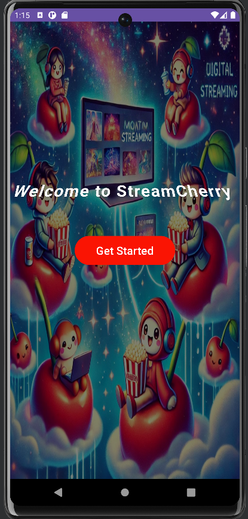

---

## 2️⃣ Sign In Screen

The login screen allows existing users to enter their **username** and **password**.  
A **"sign up"** button is provided for new users at the bottom.

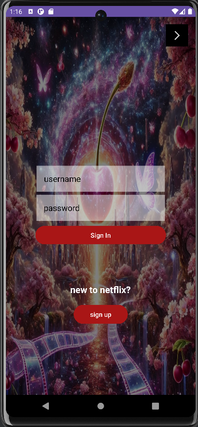

---

## 3️⃣ Sign Up Screen

New users can register by entering their email, username, nickname, password (twice), phone number, and selecting a profile picture.

---

## 4️⃣ Main Page – Movie Categories

After logging in, users are taken to the main movie screen, where they can explore categories visually.

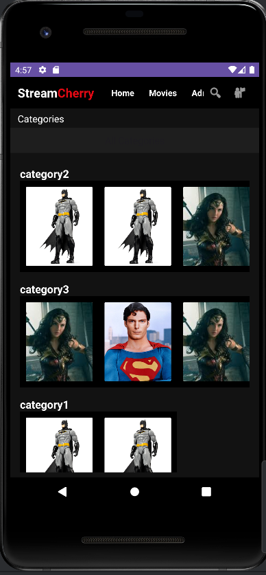

---

## 5️⃣ Search Bar – Filter by Category

Users can filter movies by categories using the search bar at the top.

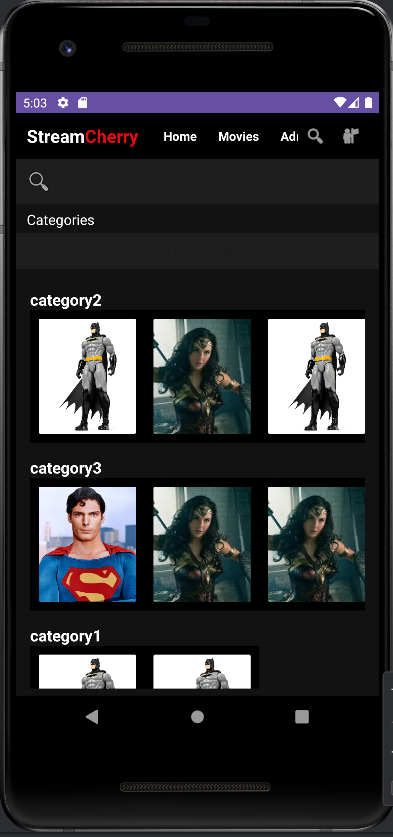

---

## 6️⃣ Movie Details

Clicking on a movie displays its full details, including title, year, duration, description, and related content.

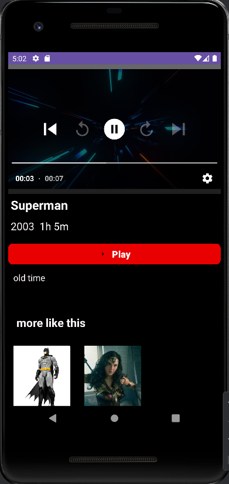

---

## 7️⃣ Movie Player

Users can watch full movies with a built-in video player interface.

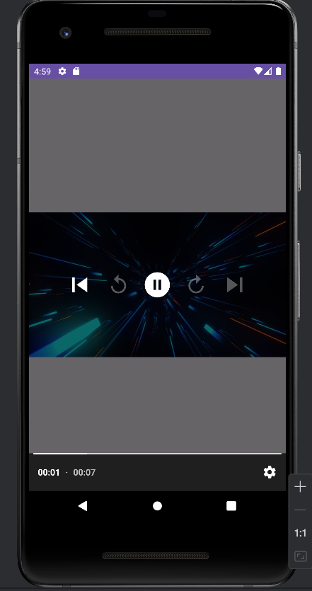

---

# 8️⃣ Admin Zone – Entry

When the logged-in user is an admin, they gain access to this special screen, which enables various management actions.

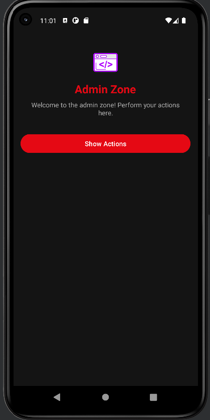

## 🎬 Movies Management

- **Add Movies:** Admins can add new movies to the system.
- **Delete Movies:** Admins can remove movies from the system.
- **Edit Movies:** Admins can modify existing movie details.

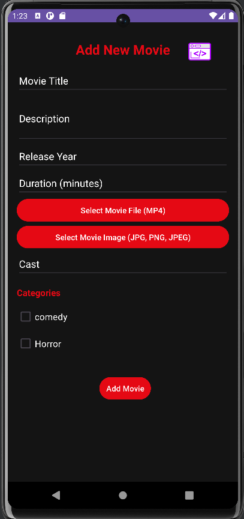 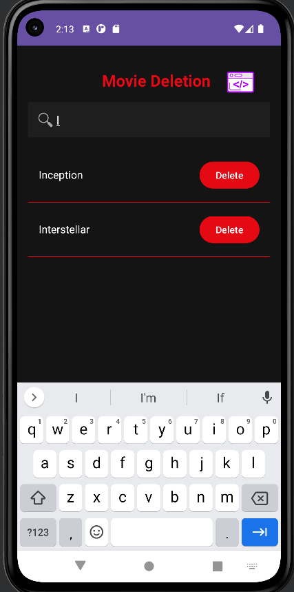  |

## 🗂️ Category Management 

- **Add New Category:** Admins can introduce new categories to the system.
- **Edit Categories:** Admins can update existing category information.
- **Delete Categories:** Admins can remove categories from the system.

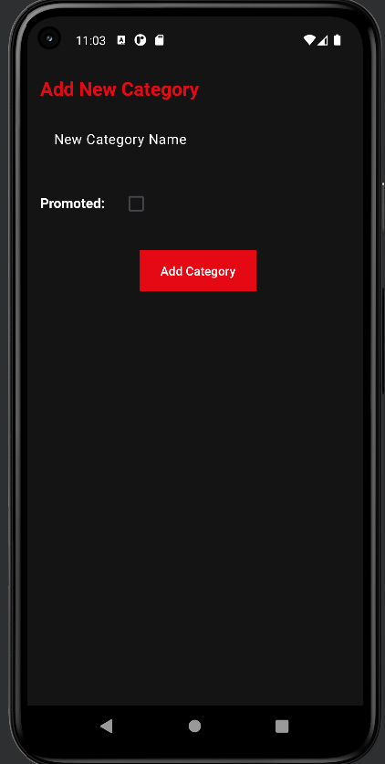 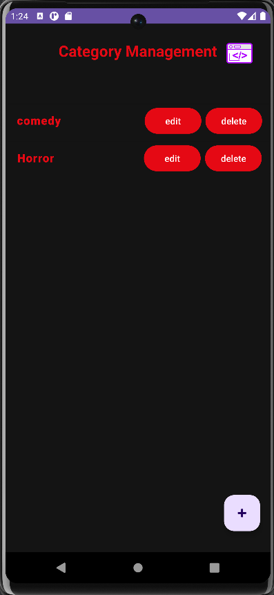 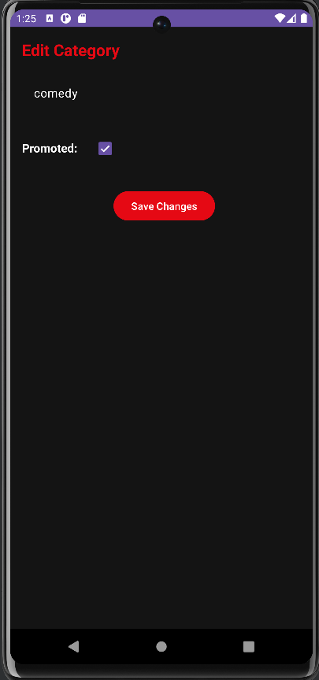

